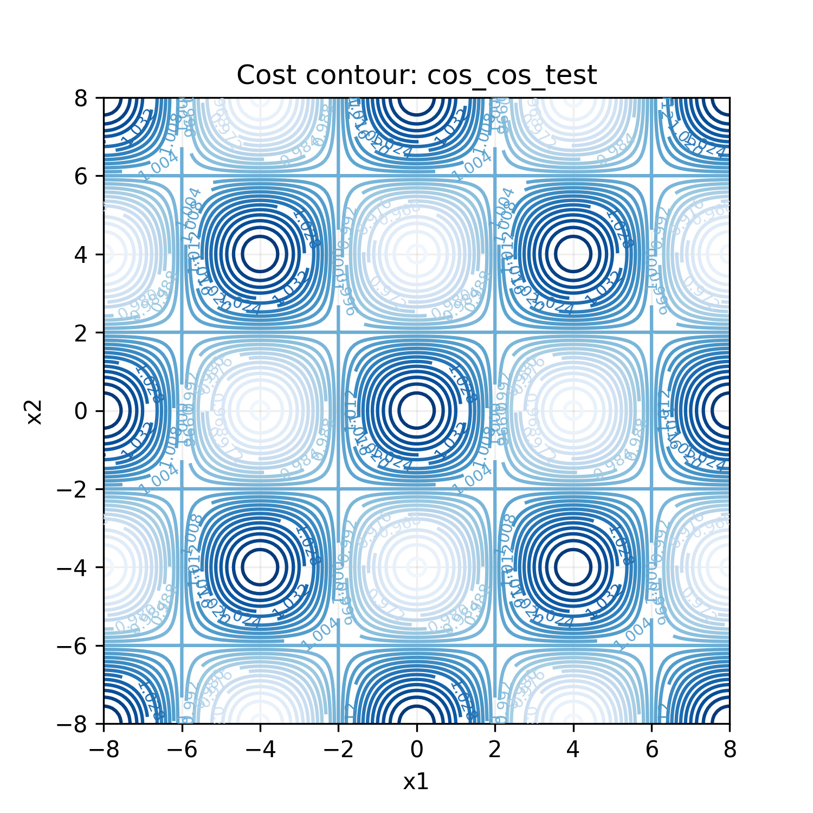
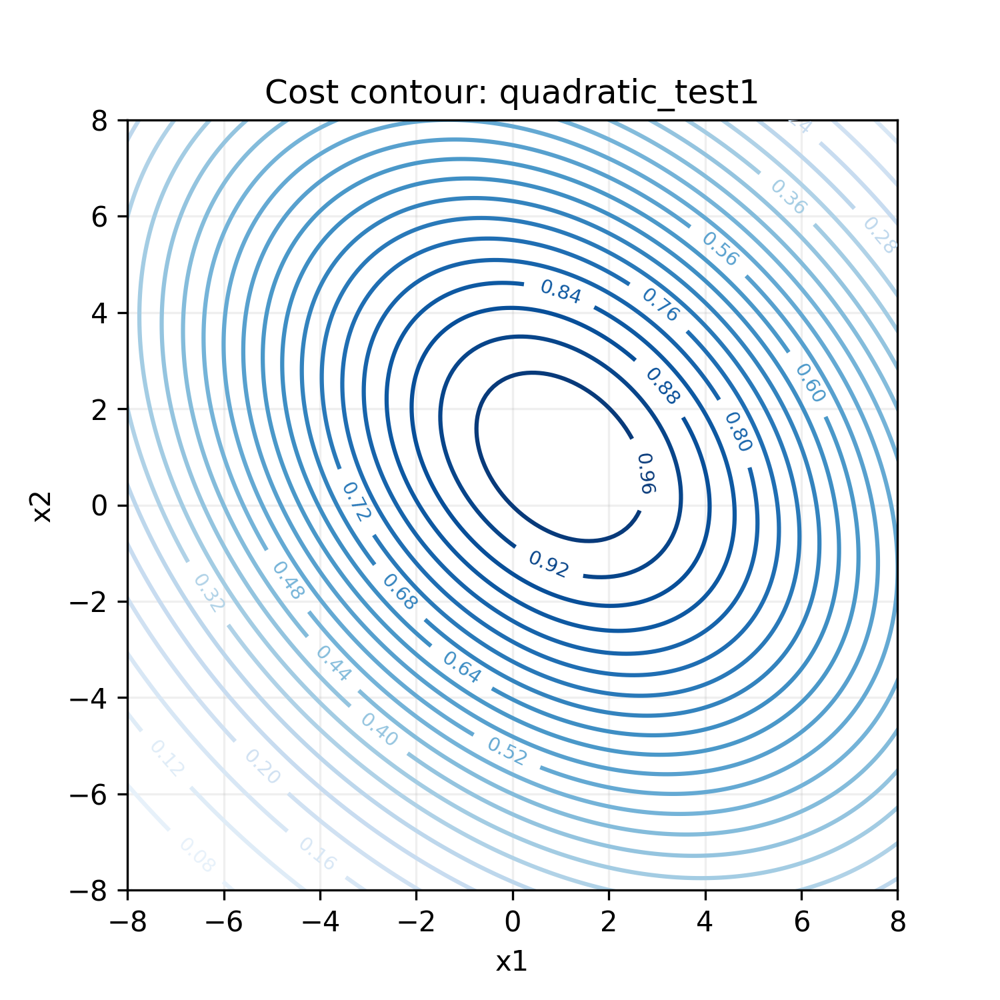
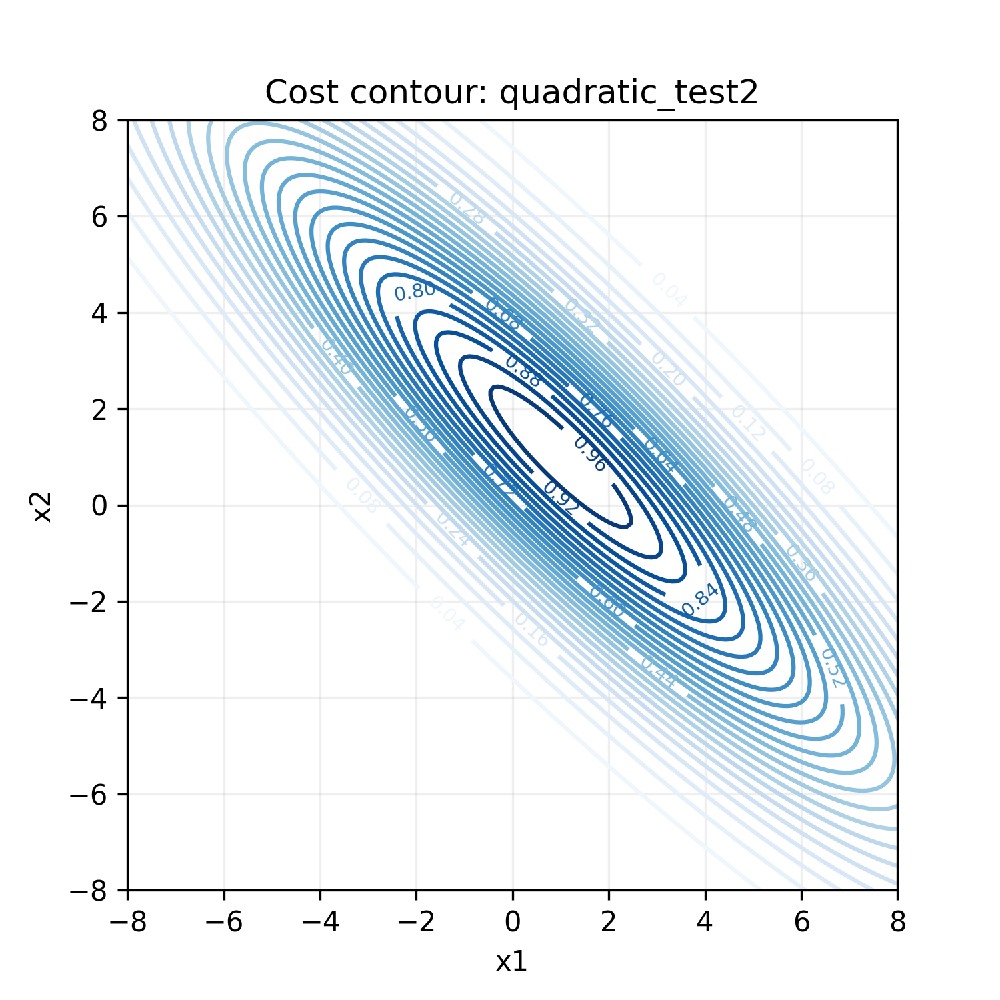
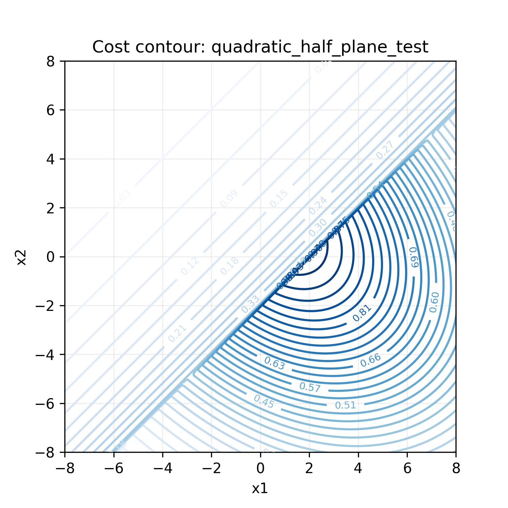
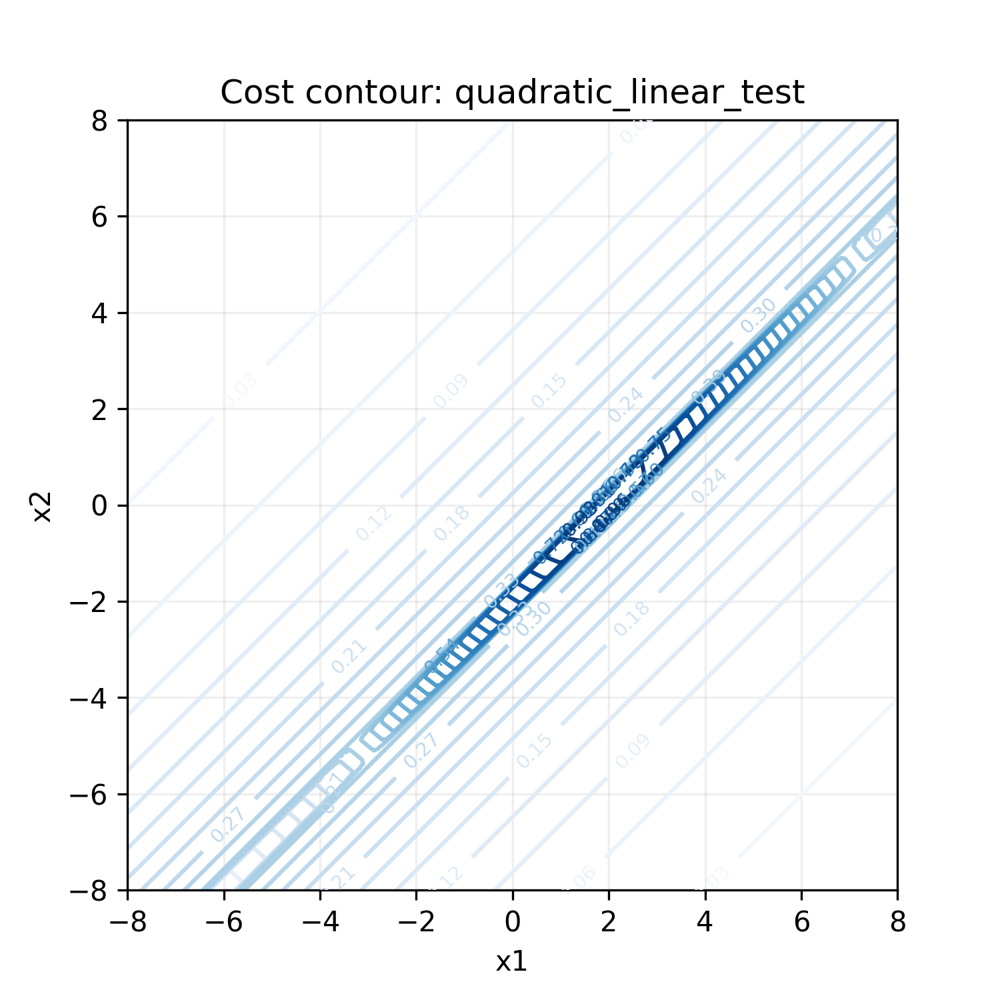
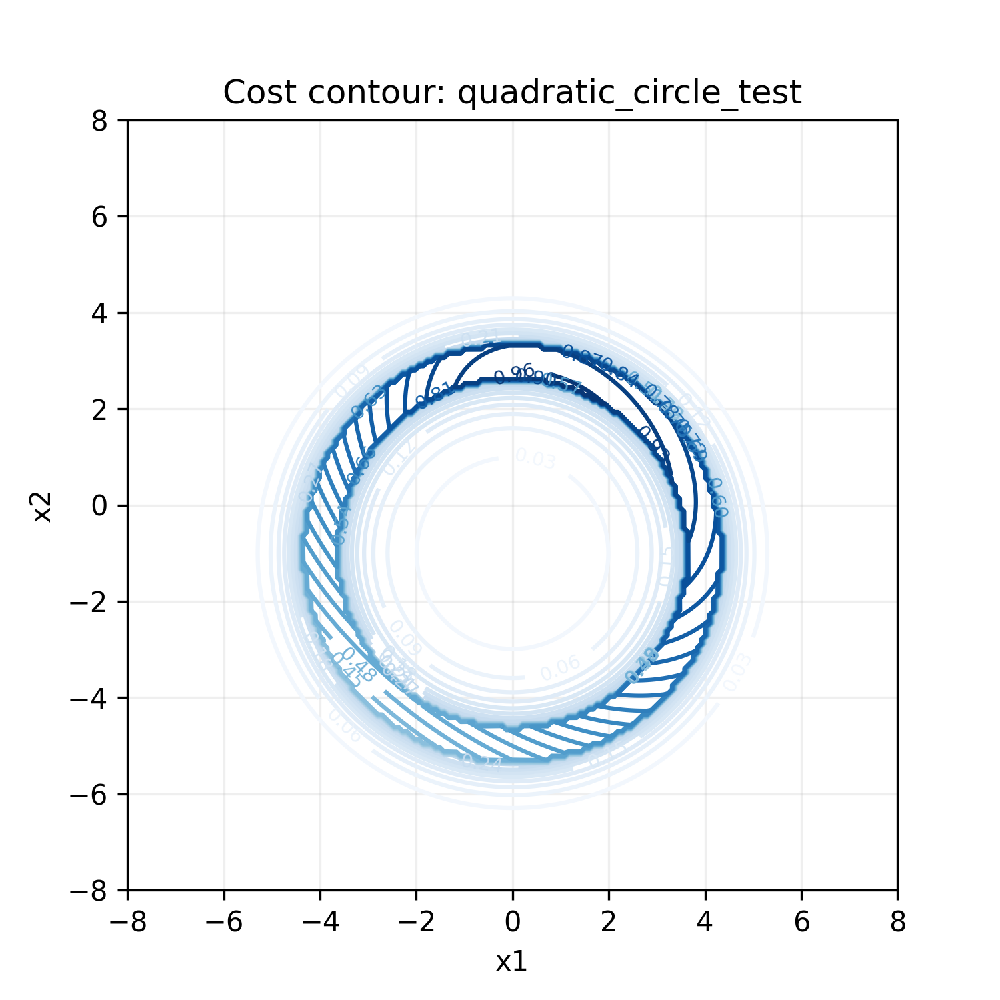

# Blockwise MGIGO 求解器详解

> **MGIGO** = Mixture of Gaussian Information-Geometric Optimization（高斯混合信息几何优化）
>
> 一句话概括：**用多个"探针云"（高斯分布）在参数空间中搜索，每次保留表现最好的探针，沿着"最陡峭的信息方向"移动探针云，逐步逼近最优解。**

---

## 目录

- [Blockwise MGIGO 求解器详解](#blockwise-mgigo-求解器详解)
  - [目录](#目录)
  - [1. 问题背景](#1-问题背景)
  - [2. 核心思想：把优化变成"猜分布"](#2-核心思想把优化变成猜分布)
  - [3. 算法流程总览](#3-算法流程总览)
  - [4. 逐步详解](#4-逐步详解)
    - [4.1 初始化：撒下探针云](#41-初始化撒下探针云)
    - [4.2 采样：掷飞镖](#42-采样掷飞镖)
    - [4.3 评估与筛选：优胜劣汰](#43-评估与筛选优胜劣汰)
    - [4.4 更新：云团向精英靠拢](#44-更新云团向精英靠拢)
      - [为什么用自然梯度？](#为什么用自然梯度)
      - [更新分三步：](#更新分三步)
    - [4.5 周期性重置：防止过早收敛](#45-周期性重置防止过早收敛)
  - [5. 分块（Blockwise）机制](#5-分块blockwise机制)
  - [6. 关键参数速查](#6-关键参数速查)
  - [7. 测试案例可视化](#7-测试案例可视化)
    - [7.1 余弦乘积（多模态）](#71-余弦乘积多模态)
    - [7.2 二次型（凸函数）](#72-二次型凸函数)
    - [7.3 各向异性二次型](#73-各向异性二次型)
    - [7.4 半平面约束](#74-半平面约束)
    - [7.5 线性走廊约束](#75-线性走廊约束)
    - [7.6 环形约束](#76-环形约束)
    - [动画图例说明](#动画图例说明)
  - [8. 代码结构](#8-代码结构)
    - [核心函数调用关系](#核心函数调用关系)
    - [技术要点](#技术要点)
  - [参考文献](#参考文献)

---

## 1. 问题背景

我们有一个**黑盒目标函数** $f(\mathbf{x})$，想找到使它最小的 $\mathbf{x}^*$：

$$\mathbf{x}^* = \arg\min_{\mathbf{x}} f(\mathbf{x})$$

- $f$ 可能非凸、多模态（有多个局部最小值）
- $f$ 可能不可导，甚至没有解析表达式
- $\mathbf{x}$ 可能由多个**语义独立的子块**组成（例如机器人的控制参数可以分为位置增益、速度增益等）

MGIGO 正是为这类问题设计的一种**无需梯度的随机搜索算法**。

---

## 2. 核心思想：把优化变成"猜分布"

传统优化算法直接操作候选解 $\mathbf{x}$。MGIGO 换了一个视角：

> 不去直接找最优的 $\mathbf{x}$，而是维护一个**搜索分布** $q(\mathbf{x})$，让它逐渐"浓缩"到最优解附近。

具体做法：

1. 用**多个高斯分布（混合模型）**覆盖搜索空间——每个高斯分量都是一个"探针云"
2. 从这些分布中**采样**候选解，用目标函数**评估**它们
3. 选出表现最好的**精英样本**
4. 沿着**自然梯度方向**更新分布参数，让分布向精英样本靠拢
5. 重复直到收敛

这样做的好处：
- **多模态探索**：多个高斯分量可以同时追踪多个有希望的区域，不容易陷入局部最优
- **不确定性量化**：分布的协方差自然地表达了搜索的"信心"——宽椭圆 = 还在探索，窄椭圆 = 已经锁定
- **无需梯度**：只需要函数值，不要求 $f$ 可导

---

## 3. 算法流程总览

```
┌─────────────────────────────────────────────────────┐
│  输入: 目标函数 f, 迭代次数 T, 样本数 B, 精英数 B₀     │
│        分量数 K, 学习率 α, 重置周期 T₀               │
└──────────────────────┬──────────────────────────────┘
                       ▼
┌─────────────────────────────────────────────────────┐
│  初始化: 为每个 block 创建 K 个高斯分布               │
│  每个高斯有: 均值 μ, 精度矩阵 S, 混合权重 π          │
└──────────────────────┬──────────────────────────────┘
                       ▼
              ┌────────────────┐
              │  t = 0...T-1   │  ← 迭代循环
              └───────┬────────┘
                      ▼
     ┌────────────────────────────────────┐
     │  步骤1: 从混合高斯中采样 B 个候选解  │
     │  - 按 π 随机选一个分量              │
     │  - 从该分量的高斯中采样一个点        │
     └────────────────┬───────────────────┘
                      ▼
     ┌────────────────────────────────────┐
     │  步骤2: 评估所有候选解 f(x₁)...f(x_B)│
     │  选出 f 值最小的 B₀ 个作为"精英"    │
     └────────────────┬───────────────────┘
                      ▼
     ┌────────────────────────────────────┐
     │  步骤3: 用精英样本更新分布参数       │
     │  - 计算每个精英对每个分量的"责任"   │
     │  - 自然梯度更新精度矩阵 S           │
     │  - 自然梯度更新均值 μ               │
     │  - Softmax更新混合权重 π            │
     └────────────────┬───────────────────┘
                      ▼
     ┌────────────────────────────────────┐
     │  步骤4: 每 T₀ 代重置精度矩阵        │
     │  - 防止搜索过早"缩死"在局部最优     │
     └────────────────┬───────────────────┘
                      ▼
              是否达到 T 次？
                 /        \
               是          否 → 回到步骤1
                ↓
┌─────────────────────────────────────────────────────┐
│  输出: 最终的各分量均值 μ、精度 S、权重 π            │
└─────────────────────────────────────────────────────┘
```

---

## 4. 逐步详解

### 4.1 初始化：撒下探针云

为参数空间的每个 block 创建 $K$ 个高斯分布。每个高斯分量 $k$ 由三个量定义：

| 参数 | 符号 | 形状 | 含义 |
|------|------|------|------|
| 均值 | $\boldsymbol{\mu}_k$ | `(D,)` | 该"探针云"的中心位置 |
| 精度矩阵 | $\mathbf{S}_k$ | `(D, D)` | 协方差的逆，控制云的形状和散布 |
| 混合权重 | $\pi_k$ | 标量 | 该分量被选中的概率（$\sum \pi_k = 1$） |

初始时：
- $\boldsymbol{\mu}_k$ 从 $\mathcal{N}(0, 2^2)$ 随机采样
- $\mathbf{S}_k = \mathbf{I}$（单位矩阵，即初始协方差为单位圆）
- $\pi_k = 1/K$（各分量等权重）

### 4.2 采样：掷飞镖

每一轮迭代，从混合高斯分布中采样 $B$ 个候选解：

1. **选分量**：按多项式分布 $\text{Categorical}(\pi_1, \ldots, \pi_K)$ 随机选一个高斯分量
2. **采样点**：从选中的高斯 $\mathcal{N}(\boldsymbol{\mu}_k, \mathbf{S}_k^{-1})$ 中采一个点

这个过程相当于"向参数空间掷 $B$ 枚飞镖"，每个飞镖的落点由当前的搜索分布决定。分布宽的地方飞镖散得开（探索），分布窄的地方飞镖集中（利用）。

**代码对应**：`_sample_from_precision()` 函数，使用 Cholesky 分解从精度矩阵参数化的高斯中高效采样：

$$\mathbf{x} = \boldsymbol{\mu} + \mathbf{L}^{-\top}\mathbf{z}, \quad \mathbf{z} \sim \mathcal{N}(0, \mathbf{I})$$

其中 $\mathbf{S} = \mathbf{L}\mathbf{L}^\top$。

### 4.3 评估与筛选：优胜劣汰

对所有 $B$ 个候选解计算目标函数值 $f(\mathbf{x}_i)$，按从小到大排序，选前 $B_0$ 个作为**精英样本**。

> 这里的逻辑是：$f$ 越小越好，所以数值最小的 $B_0$ 个样本被认为是最有希望的方向。

**代码对应**：`_one_iteration()` 中的 `jnp.argsort(f_vals)[:b0_elite]`。

### 4.4 更新：云团向精英靠拢

这是算法的核心。有了精英样本后，我们需要把搜索分布往精英方向"挪动"。常规做法是用梯度下降，但这里我们用的是**自然梯度**（Natural Gradient）。

#### 为什么用自然梯度？

普通梯度 $\nabla f$ 依赖于参数空间的**欧氏距离**——它对参数化方式敏感。自然梯度 $\tilde{\nabla} f = \mathbf{F}^{-1} \nabla f$（$\mathbf{F}$ 是 Fisher 信息矩阵）则使用**KL 散度定义的"信息距离"**，不受参数化影响。对于概率分布族，自然梯度给出了"在分布空间中每单位 KL 变化下，目标函数下降最快的方向"。

#### 更新分三步：

**第一步：计算责任（Responsibilities）**

对于每个精英样本 $\mathbf{x}_b$ 和每个分量 $k$，计算这个样本"属于"这个分量的后验概率：

$$a_{kb} = \frac{  p(\mathbf{x}_b | \boldsymbol{\mu}_k, \mathbf{S}_k)}{\sum_{j} \pi_j \cdot p(\mathbf{x}_b | \boldsymbol{\mu}_j, \mathbf{S}_j)}$$

其中 $p(\mathbf{x} | \boldsymbol{\mu}, \mathbf{S})$ 是高斯密度。$a_{kb}$ 越大，说明分量 $k$ 对精英样本 $b$ "解释得越好"，更新时就应该更多地参考它。

**第二步：自然梯度更新精度矩阵**

$$\mathbf{S}_k^{\text{new}} = \mathbf{S}_k - \alpha \cdot \sum_{b} w_b \cdot a_{kb} \cdot (\mathbf{S}_k \mathbf{d}_{kb} \mathbf{d}_{kb}^\top \mathbf{S}_k - \mathbf{S}_k)$$

其中 $\mathbf{d}_{kb} = \mathbf{x}_b - \boldsymbol{\mu}_k$，$w_b = 1/B$，$\alpha$ 是学习率。

**直觉**：如果大多数精英样本都集中在某个方向很窄的范围内，精度矩阵在那个方向上会增大（协方差缩小），表示"找到了，缩小搜索范围"。反之，如果精英分散，精度矩阵变化就小。

**第三步：自然梯度更新均值**

$$\boldsymbol{\mu}_k^{\text{new}} = \boldsymbol{\mu}_k + \alpha \cdot (\mathbf{S}_k^{\text{new}})^{-1} \sum_{b} w_b \cdot a_{kb} \cdot \mathbf{S}_k \mathbf{d}_{kb}$$

**直觉**：均值被拉向精英样本的加权平均方向。用精度矩阵做"度量张量"，确保在分布已经收缩的方向上（精度大），均值只做小步移动（因为已经比较确定了）；在分布还很宽的方向上（精度小），均值可以大步移动。

**第四步：Softmax 更新混合权重**

$$\pi \leftarrow \text{softmax}\left(\log\frac{\pi_{1:K-1}}{\pi_K} + \alpha \cdot \sum_b w_b(a_{1:K-1,b} - a_{K,b})\right)$$

**直觉**：能更好地"解释"精英样本的分量获得更多权重；解释力差的分量权重衰减，逐渐被淘汰。

**代码对应**：`_update_block()` 函数（第 105-161 行）。

### 4.5 周期性重置：防止过早收敛

每 $T_0$ 次迭代，将精度矩阵重置为单位矩阵，混合权重重置为均匀分布（但**保留均值**）。

```python
# 在 igo_test.py 中每 t0 代：
if t % t0 == 0:
    cur_mu, cur_l_inv, cur_v = final_mu_np, initial_l_inv, initial_v  # 重置精度和权重
```

**直觉**：如果搜索过早地缩成一个很小的区域（精度过高），可能会错失更远处更好的解。定期"松开"协方差相当于重新开始探索，但保留已经学到的均值（大致位置），这是一种**探索-利用平衡**策略。

下面的视频对比展示了有无重置机制的区别：

| 无重置 | 有重置 |
|--------|--------|
| [cos_igo_test_no_reset.mp4](output_igo_test/cos_igo_test_no_reset.mp4) | [cos_cos_test_with_reset.mp4](output_igo_test/cos_cos_test_with_reset.mp4) |

---

## 5. 分块（Blockwise）机制

当优化变量可以自然地分成多个语义独立的子块时（例如机器人的位置参数和姿态参数），可以**每个子块维护独立的混合高斯分布**，但评估时组合在一起。

```
Block 1 (3维)          Block 2 (2维)          Block N (4维)
┌──────────┐          ┌──────────┐          ┌──────────┐
│ K个高斯   │          │ K个高斯   │          │ K个高斯   │
│ μ₁[0:D₁] │          │ μ₂[0:D₂] │   ...    │ μ_N[0:D_N]│
│ S₁[D₁,D₁] │          │ S₂[D₂,D₂]│          │ S_N[D_N,D_N]│
│ π₁       │          │ π₂       │          │ π_N       │
└──────────┘          └──────────┘          └──────────┘
     │                     │                     │
     └─────────────────────┼─────────────────────┘
                           ▼
              组合为完整向量 x = [x₁ | x₂ | ... | x_N]
                           │
                           ▼
                  统一评估 f(x)
                           │
                           ▼
              精英选择后，各 block 独立更新
```

这样做的好处：
- **维度灾难缓解**：每个 block 的协方差矩阵是 $D_i \times D_i$，而不是总维度 $\sum D_i$ 的平方
- **语义独立性**：不同物理含义的参数不会被不当耦合
- **并行化**：各 block 的更新可以独立进行（JAX 的 `vmap` 实现）

**代码对应**：
- `_pack_sample_from_blocks()`（第 49-51 行）：将各 block 的样本拼接为完整向量
- `jax.vmap(_update_block)`（第 203 行）：对各 block 并行执行更新

在当前的 2D 测试中（`dims=(2,), m=1`），只有一个 block，所以 blockwise 的优势不明显。但当扩展到更高维度（例如优化曲线控制点，每个控制点是一个 block），这个设计就至关重要了。

---

## 6. 关键参数速查

| 参数 | 符号 | 默认值 | 作用 |
|------|------|--------|------|
| 分量数 | $K$ | 5 | 高斯混合的分量个数。越大探索能力越强，但计算量也越大 |
| 样本数 | $B$ | 300 | 每轮采样的候选解数量 |
| 精英数 | $B_0$ | 100 | 每轮保留的精英样本数。$B_0/B$ 越小，选择压力越大 |
| 学习率 | $\alpha$ | 0.15 | 自然梯度的步长。太大不稳定，太小收敛慢 |
| 重置周期 | $T_0$ | 200 | 多少代后重置精度矩阵 |
| 总迭代 | $T$ | 600 | 总的迭代轮数 |
| Block 维度 | `dims` | `(2,)` | 每个 block 的维度。单 block 2D 用于测试 |

---

## 7. 测试案例可视化

以下展示了 6 种不同目标函数上 MGIGO 的表现。每张图展示的是目标函数的**指数变换** $e^{-f(x) \cdot 0.05}$（越亮的地方 $f$ 越小，越是最优区域）：

### 7.1 余弦乘积（多模态）

$$f(x_1, x_2) = -\cos\left(\frac{\pi x_1}{4}\right) \cdot \cos\left(\frac{\pi x_2}{4}\right)$$

这是一个高度多模态的函数，有多个等深的全局最优。考验算法同时追踪多个模态的能力。



**优化过程视频**：[cos_cos_test_with_reset.mp4](output_igo_test/cos_cos_test_with_reset.mp4)

### 7.2 二次型（凸函数）

$$f(x_1, x_2) = \frac{2(x_1 + x_2 - 2)^2 + (x_1 - x_2)^2}{10}$$

标准的凸二次型，全局最优在 $(1, 1)$，检验算法在简单问题上的收敛速度和精度。



**优化过程视频**：[quadratic1_test.mp4](output_igo_test/quadratic1_test.mp4)

### 7.3 各向异性二次型

$$f(x_1, x_2) = \frac{20(x_1 + x_2 - 2)^2 + (x_1 - x_2)^2}{10}$$

与 7.2 类似，但 $x_1 + x_2$ 方向的权重是 $x_1 - x_2$ 的 20 倍，形成一个**狭长的山谷**。考验算法处理各向异性（不同方向尺度差异大）的能力。



**优化过程视频**：[quadratic_test2.mp4](output_igo_test/quadratic_test2.mp4)

### 7.4 半平面约束

$$
f(x_1, x_2) = \begin{cases}
-5(x_1 - x_2 - 2) + 20 & \text{if } x_1 - x_2 < 2 \\
\frac{2(x_1 + x_2 - 2)^2 + (x_1 - x_2)^2}{10} & \text{otherwise}
\end{cases}
$$

一侧是线性斜坡，另一侧是二次型。考验算法跨越不连续边界的能力。



### 7.5 线性走廊约束

$$
f(x_1, x_2) = \begin{cases}
5|x_1 - x_2 - 2| + 20 & \text{if } |x_1 - x_2 - 2| > 0.3 \\
\frac{2(x_1 + x_2 - 2)^2 + (x_1 - x_2)^2}{10} & \text{otherwise}
\end{cases}
$$

只有在一条窄带内才是平滑的二次型，窄带外被线性惩罚"推回"。考验算法在**狭长可行域**中的搜索能力。



**优化过程视频**：[quadratic_linear_test.mp4](output_igo_test/quadratic_linear_test.mp4)

### 7.6 环形约束

$$
f(x_1, x_2) = \begin{cases}
5\big|x_1^2 + (x_2+1)^2 - 16\big| + 10 & \text{if } \big|x_1^2 + (x_2+1)^2 - 16\big| > 3 \\
\frac{2(x_1 + x_2 - 2)^2 + (x_1 - x_2)^2}{10} & \text{otherwise}
\end{cases}
$$

可行域是一个**圆环**（annulus），最优区域在圆环内。考验算法处理非线性约束的能力。



**优化过程视频**：[quadratic_circle_test_with_reset.mp4](output_igo_test/quadratic_circle_test_with_reset.mp4)

---

### 动画图例说明

在优化过程视频中：

| 元素 | 含义 |
|------|------|
| 🔵 蓝色背景等高线 | 目标函数的 $e^{-f \cdot 0.05}$ 变换（亮 = 好） |
| ⚫ 灰色散点 | 当前轮采样的候选解，颜色越亮（黄）成本越低 |
| ◆ 橙色菱形 | 各高斯分量的均值 $\boldsymbol{\mu}_k$ |
| ⭐ 金色五角星 | 当前最佳分量的均值 |
| 🟠 橙色椭圆 | 各分量的 $3\sigma$ 等概率椭圆（越大 = 探索越广） |
| ⚫ 黑色虚线椭圆 | 最佳分量的 $3\sigma$ 椭圆 |

随着迭代进行，你会看到：
1. 橙色椭圆逐渐缩小 → 搜索从"广撒网"变为"精准打击"
2. 散点向亮区聚集 → 候选解的质量不断提高
3. 多个菱形可能分散在不同谷底 → 多模态探索能力

---

## 8. 代码结构

```
igo/
├── blockwise_mgigo_jax.py   ← 核心求解器（本文件）
├── utils.py                  ← 协方差计算、采样、统计
└── plot_utils.py             ← 可视化工具

igo_test.py                   ← 测试入口，6个测试函数
output_igo_test/              ← 输出的图片和视频
```

### 核心函数调用关系

```
mmog_igo_optimizer_mpc()          ← 兼容 MPC 接口的顶层包装
  └── blockwise_mgigo()           ← 算法主循环
        └── lax.scan(             ← JAX 高效循环
              _one_iteration()    ← 单次迭代
                ├── 采样: _sample_from_precision()
                ├── 评估: objective_fn()
                ├── 精英选择: argsort()[:b0_elite]
                └── _update_block()  ← 自然梯度更新
                      ├── 责任计算 (E-step)
                      ├── 精度更新 (M-step S)
                      ├── 均值更新 (M-step μ)
                      └── 权重更新 (M-step π)
```

### 技术要点

- **全 JAX 实现**：所有操作都是 JAX 可追踪的，支持 `jit` 编译和 GPU 加速
- **`lax.scan`**：取代 Python for 循环，将整个迭代过程编译为单个 XLA 计算图
- **`vmap` 批量化**：block 间更新和分量间计算都通过 `vmap` 自动并行
- **Cholesky 参数化**：用 Cholesky 因子 $\mathbf{L}$（$\mathbf{S} = \mathbf{L}\mathbf{L}^\top$）保证精度矩阵始终正定
- **Mask 机制**：不同 block 可能维度不同，用 mask 处理变长维度（填充到 `d_max`）

---

## 参考文献

MGIGO 属于 **Information-Geometric Optimization (IGO)** 算法家族，与以下方法有密切联系：

- **CMA-ES**（协方差矩阵自适应进化策略）：同样维护高斯搜索分布，但使用不同的更新规则
- **Natural Evolution Strategies (NES)**：直接使用自然梯度更新搜索分布
- **EM（期望最大化）算法**：MGIGO 的更新步骤（责任计算 → 参数更新）在结构上类似于 EM 的 E-step 和 M-step

核心区别在于 MGIGO 使用**混合高斯** + **精英选择** + **自然梯度**，这三个要素的组合使其特别适合多模态、中等维度的黑盒优化问题。
