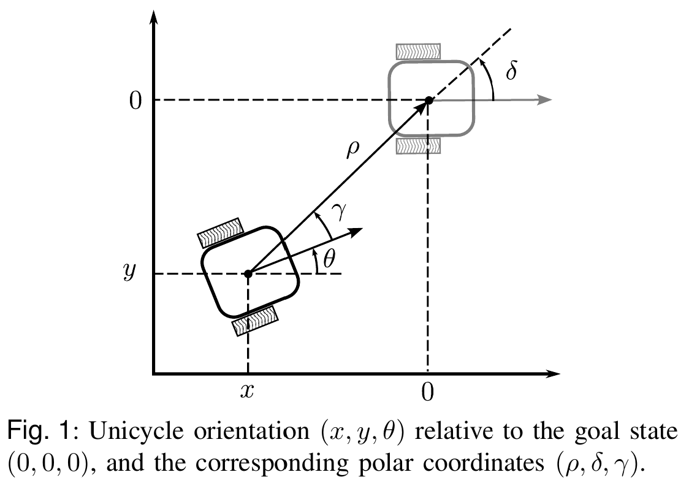

# 逆最优控制

## 1. 逆最优控制理论基础

### 1.1 最优控制与逆最优控制

**最优控制（Direct Optimal Control）** 回答的问题是：

> 给定代价函数 $J$，求控制律 $\mathbf{u}^*$ 使 $J$ 最小。

对于仿射非线性系统 $\dot{\mathbf{x}} = \mathbf{f}(\mathbf{x}) + \mathbf{g}(\mathbf{x})\mathbf{u}$，考虑无限时域代价函数：

$$J = \int_0^\infty \big[ l(\mathbf{x}) + \mathbf{u}^\top \mathbf{R}(\mathbf{x}) \mathbf{u} \big] \, dt$$

其中 $l(\mathbf{x}) \geq 0$ 是状态代价，$\mathbf{R}(\mathbf{x}) \succ 0$ 是控制权重矩阵。最优控制律 $\mathbf{u}^*$ 由 **Hamilton-Jacobi-Bellman（HJB）方程** 刻画：

$$\min_{\mathbf{u}} \left\{ l(\mathbf{x}) + \mathbf{u}^\top \mathbf{R} \mathbf{u} + \nabla V \cdot \big[ \mathbf{f}(\mathbf{x}) + \mathbf{g}(\mathbf{x})\mathbf{u} \big] \right\} = 0$$

其中 $V(\mathbf{x})$ 是最优值函数（optimal value function），表示从状态 $\mathbf{x}$ 出发的最小累计代价。对 $\mathbf{u}$ 求导可得最优控制律的解析形式：

$$\mathbf{u}^*(\mathbf{x}) = -\frac{1}{2} \mathbf{R}^{-1}(\mathbf{x}) \mathbf{g}^\top(\mathbf{x}) \nabla V(\mathbf{x})$$

但 HJB 是一个偏微分方程，对一般非线性系统**极难求解**。只有 LQR 等少数特例有闭式解。

**逆最优控制（Inverse Optimal Control）** 则反过来思考：

> 先设计一个镇定控制律 $\mathbf{u} = \mathbf{k}(\mathbf{x})$，然后构造一个"有意义的"代价函数，使该控制律成为这个代价函数下的最优控制。

```
前向（直接）:  代价函数 J  ──→  求解 HJB  ──→  最优控制律 u*
逆向（IOC）:   镇定控制器 u  ──→  构造 CLF  ──→  代价函数 J
```

这一思想由 **Kalman (1964)** 在线性二次型框架下提出，后被 **Freeman & Kokotović (1996)** 推广到非线性系统。

### 1.2 核心工具：控制 Lyapunov 函数（CLF）

**定义**：一个光滑、正定、径向无界的函数 $V(\mathbf{x})$ 称为**控制 Lyapunov 函数（Control Lyapunov Function, CLF）**，如果：

$$\inf_{\mathbf{u}} \left\{ \nabla V \cdot \big[ \mathbf{f}(\mathbf{x}) + \mathbf{g}(\mathbf{x}) \mathbf{u} \big] \right\} < 0, \quad \forall \mathbf{x} \neq \mathbf{0}$$

这个条件的直观含义是：**无论系统处于什么状态，总存在某个控制输入能使 $V$ 减小**。CLF 的存在性等价于系统的可镇定性和可稳性。

给定一个 CLF，可以构造**点状最小范数（Pointwise Min-Norm, PMN）**控制器：

$$\mathbf{u}_{\text{PMN}}(\mathbf{x}) = \arg\min_{\mathbf{u}} \|\mathbf{u}\|^2 \quad \text{s.t.} \quad \nabla V \cdot \big[ \mathbf{f}(\mathbf{x}) + \mathbf{g}(\mathbf{x}) \mathbf{u} \big] \leq -\sigma(\mathbf{x})$$

其中 $\sigma(\mathbf{x}) > 0$ 是保证 Lyapunov 下降速率的正定函数。这个约束优化问题有闭式解：

$$
\mathbf{u}_{\text{PMN}}(\mathbf{x}) = \begin{cases}
-\dfrac{L_f V + \sigma(\mathbf{x})}{\|L_g V\|^2} (L_g V)^\top, & L_g V \neq \mathbf{0} \\[10pt]
\mathbf{0}, & L_g V = \mathbf{0}
\end{cases}
$$

其中 $L_f V = \nabla V \cdot \mathbf{f}$ 和 $L_g V = \nabla V \cdot \mathbf{g}$ 分别是 $V$ 沿 $\mathbf{f}$ 和 $\mathbf{g}$ 方向的 Lie 导数。

### 1.3 逆最优性的核心定理

**定理（Freeman & Kokotović, 1996）**：设 $V(\mathbf{x})$ 是系统 $\dot{\mathbf{x}} = \mathbf{f}(\mathbf{x}) + \mathbf{g}(\mathbf{x})\mathbf{u}$ 的一个 CLF，$\mathbf{u} = \mathbf{k}(\mathbf{x})$ 是任意满足以下条件的连续镇定控制律：

$$\nabla V \cdot \big[ \mathbf{f}(\mathbf{x}) + \mathbf{g}(\mathbf{x}) \mathbf{k}(\mathbf{x}) \big] < 0, \quad \forall \mathbf{x} \neq \mathbf{0}$$

则该控制律关于以下代价函数是**逆最优**的：

$$J = \int_0^\infty \big[ l(\mathbf{x}) + \mathbf{u}^\top \mathbf{R}(\mathbf{x}) \mathbf{u} \big] \, dt$$

其中状态代价 $l(\mathbf{x})$ 由下式构造：

$$l(\mathbf{x}) = -\nabla V \cdot \big[ \mathbf{f} + \mathbf{g}\mathbf{k} \big] - \frac{1}{2} \mathbf{k}^\top \mathbf{R} \mathbf{k} + \frac{1}{4} \nabla V \mathbf{g} \mathbf{R}^{-1} \mathbf{g}^\top (\nabla V)^\top$$

并且 $l(\mathbf{x}) > 0$ 对所有 $\mathbf{x} \neq \mathbf{0}$ 成立（即代价函数是"有意义的"），$V(\mathbf{x})$ 本身就是该最优控制问题的值函数。

**这个定理的意义在于**：只要找到了一个 CLF 和一个使它递减的控制器，就**自动**得到了一个使该控制器最优的代价函数——不需要求解 HJB 方程。

### 1.4 Sontag 公式

Sontag (1989) 给出了从 CLF 构造镇定控制器的**通用公式**。对单输入系统 $\dot{\mathbf{x}} = \mathbf{f}(\mathbf{x}) + \mathbf{g}(\mathbf{x}) u$：

$$
u_S(\mathbf{x}) = \begin{cases}
-\dfrac{L_f V + \sqrt{(L_f V)^2 + q(\mathbf{x}) (L_g V)^4}}{(L_g V)^2} \cdot L_g V, & L_g V \neq 0 \\[10pt]
0, & L_g V = 0
\end{cases}
$$

其中 $q(\mathbf{x}) > 0$ 是设计者选择的权重函数，控制"激进程度"。Sontag 公式是 PMN 控制器的特例（取 $\sigma(\mathbf{x}) = \sqrt{(L_f V)^2 + q(\mathbf{x}) (L_g V)^4}$），并且是**逆最优**的——对应的代价函数可通过第 3.3 节的定理构造。

---

## 2. 双轮差速移动机器人的逆最优分析

### 2.1 系统模型

在笛卡尔坐标系下，双轮差速移动机器人的运动学模型如下：

$$
\dot{x} = v \cos \theta, \\
\dot{y} = v \sin \theta, \\
\dot{\theta} = \omega.
$$

控制律在极坐标下设计，两个坐标系下的状态变量关系如下：

$$
\rho = \sqrt{x^2 + y^2}, \\
\delta = \arctan(y/x) + \pi = 2 \arctan( \frac{\rho - x}{y}) + \pi, \\
\gamma = \delta - \theta = \arctan(y/x) + \pi - \theta.
$$

如下图所示：



极坐标下的系统模型如下：

$$
\dot{\rho} = -v \cos \gamma, \\
\dot{\delta} = \frac{v}{\rho} \sin \gamma, \\
\dot{\gamma} = \frac{v}{\rho} \sin \gamma - \omega.
$$

为方便后续逆最优分析，将系统写为仿射非线性形式 $\dot{\mathbf{x}} = \mathbf{f}(\mathbf{x}) + \mathbf{g}(\mathbf{x})\mathbf{u}$：

$$
\underbrace{\begin{bmatrix} \dot{\rho} \\ \dot{\delta} \\ \dot{\gamma} \end{bmatrix}}_{\dot{\mathbf{x}}}
= \underbrace{\begin{bmatrix} 0 \\ 0 \\ 0 \end{bmatrix}}_{\mathbf{f}(\mathbf{x})}
+ \underbrace{\begin{bmatrix} -\cos\gamma & 0 \\ \frac{\sin\gamma}{\rho} & 0 \\ \frac{\sin\gamma}{\rho} & -1 \end{bmatrix}}_{\mathbf{g}(\mathbf{x})}
\underbrace{\begin{bmatrix} v \\ \omega \end{bmatrix}}_{\mathbf{u}}
$$

---

### 2.2 控制律设计

假设需要镇定系统到原点（其他位置可以先通过变换将其转化为原点问题），即 $\rho = 0, \delta = 0, \gamma = 0$，则可以设计如下控制律：

$$
v = k_1 \rho \cos \gamma, \\
\omega = \frac{k_1}{2} \sin(2\gamma) + \tilde{\omega}.
$$

其中 $\tilde{\omega}$ 可选如下4种形式：

$$
\tilde{\omega}_1 = k_2 \sin(\gamma) + k_3 \frac{\sin 2\gamma}{2\gamma} \delta, \\
\tilde{\omega}_2 = k_2 \sin(\gamma) + \frac{k_3 \cos(\gamma)}{ \left( 1 + \tan^2(\gamma/2) \right)^2}\delta, \\
\tilde{\omega}_3 = k_2 \sin(\gamma) + 2 k_3 \frac{\sin 2\gamma}{2\gamma} \left( 1 + \tan^2(\delta/2) \right) \tan(\delta / 2), \\
\tilde{\omega}_4 = k_2 \sin(\gamma) + 2 k_3 \frac{\cos \gamma}{ \left( 1 + \tan^2(\gamma/2) \right)^2} \left( 1 + \tan^2(\delta/2) \right) \tan(\delta / 2).
$$

---

### 2.3 构造控制 Lyapunov 函数

对于极坐标下的运动学模型，考虑如下候选 CLF：

$$V(\rho, \delta, \gamma) = \frac{1}{2} \rho^2 + \frac{1}{2} \delta^2 + 2\left(1 - \cos\frac{\gamma}{2}\right)$$

这个函数具有明确的物理意义：
- $\frac{1}{2}\rho^2$：惩罚到原点的距离
- $\frac{1}{2}\delta^2$：惩罚方位角偏差
- $2(1 - \cos\frac{\gamma}{2})$：惩罚朝向角偏差（$\gamma = 0$ 时该项为 $0$，$\gamma = \pm\pi$ 时最大）

$V$ 显然正定（$V > 0$ 对所有非零状态）且径向无界（$\|\mathbf{x}\| \to \infty$ 时 $V \to \infty$）。

计算 $V$ 沿系统动力学的 Lie 导数：

$$\nabla V = \begin{bmatrix} \rho, & \delta, & \sin\frac{\gamma}{2}\cos\frac{\gamma}{2} \end{bmatrix} = \begin{bmatrix} \rho, & \delta, & \frac{1}{2}\sin\gamma \end{bmatrix}$$

$$
L_f V = \nabla V \cdot \mathbf{f} = 0
$$

$$
L_g V = \nabla V \cdot \mathbf{g} = \begin{bmatrix} -\rho\cos\gamma + \frac{\delta\sin\gamma}{\rho} + \frac{\sin^2\gamma}{2\rho}, & -\frac{1}{2}\sin\gamma \end{bmatrix}
$$

### 2.3a 四种 CLF 设计方案

第 2.3 节给出了 CLF 的一般形式，实际上对应于四种不同的状态空间 $\hat{\mathcal{S}}$，每种都有特定的 CLF 设计，分别对应四种 $\tilde{\omega}$ 变体。下面给出每种 CLF 的完整数学表达式、梯度和 Lie 导数。

---

#### CLF 0 — 状态空间 $\mathcal{S}$（对应 $\tilde{\omega}_1$，sinc 型耦合）

$$V_0(\rho, \delta, \gamma) = \rho^2 + \frac{1}{2}(\delta^2 + \gamma^2 + 2)^2 - 2 + (\delta + \gamma)^2$$

展开形式：

$$V_0 = \rho^2 + \frac{1}{2}(\delta^4 + \gamma^4) + \delta^2\gamma^2 + 3\delta^2 + 3\gamma^2 + 2\delta\gamma$$

梯度：

$$\nabla V_0 = \begin{bmatrix}
2\rho \\
2\delta(\delta^2 + \gamma^2 + 2) + 2(\delta + \gamma) \\
2\gamma(\delta^2 + \gamma^2 + 2) + 2(\delta + \gamma)
\end{bmatrix}^\top$$

该 CLF 的特点是 $\delta$ 和 $\gamma$ 通过 $(\delta + \gamma)^2$ 产生交叉耦合项 $2\delta\gamma$，对应于 $\tilde{\omega}_1$ 中 $\frac{\sin 2\gamma}{2\gamma}\delta$（sinc 型）的线性 $\delta$ 耦合。

---

#### CLF 1 — 状态空间 $\mathcal{S}_1$（对应 $\tilde{\omega}_2$，$\gamma$ 快速衰减型）

$$V_1(\rho, \delta, \gamma) = \rho^2 + (\delta + \sin\gamma)^2 + 4\tan^2\frac{\gamma}{2}$$

梯度：

$$\nabla V_1 = \begin{bmatrix}
2\rho \\
2(\delta + \sin\gamma) \\
2(\delta + \sin\gamma)\cos\gamma + 4\tan\frac{\gamma}{2}\left(1 + \tan^2\frac{\gamma}{2}\right)
\end{bmatrix}^\top$$

该 CLF 的特点是用 $(\delta + \sin\gamma)^2$ 替代独立的 $\delta^2$ 项，$\delta$ 和 $\gamma$ 通过 $\sin\gamma$ 耦合，且用 $4\tan^2\frac{\gamma}{2}$ 作为纯 $\gamma$ 惩罚。对应于 $\tilde{\omega}_2$ 中 $\frac{\cos\gamma}{(1+\tan^2(\gamma/2))^2}\delta$ 的 $\gamma$ 快速衰减型耦合。

---

#### CLF 2 — 状态空间 $\mathcal{S}_2$（对应 $\tilde{\omega}_3$，$\delta$ 增强型）

$$V_2(\rho, \delta, \gamma) = \rho^2 + \delta^2 + \left(\gamma + \frac{1}{2}\arctan\!\left(4\tan\frac{\delta}{2}\right)\right)^2$$

梯度：

$$\nabla V_2 = \begin{bmatrix}
2\rho \\
2\delta + 2\left(\gamma + \frac{1}{2}\arctan\!\left(4\tan\frac{\delta}{2}\right)\right) \cdot \dfrac{1+\tan^2\frac{\delta}{2}}{1+16\tan^2\frac{\delta}{2}} \\
2\left(\gamma + \frac{1}{2}\arctan\!\left(4\tan\frac{\delta}{2}\right)\right)
\end{bmatrix}^\top$$

该 CLF 的特点是用 $\frac{1}{2}\arctan(4\tan\frac{\delta}{2})$ 作为 $\delta$-$\gamma$ 耦合机制，$\arctan$ 函数将 $\tan\frac{\delta}{2}$ 映射回有限范围，在 $\delta$ 较大时增强耦合。对应于 $\tilde{\omega}_3$ 中 $2\frac{\sin 2\gamma}{2\gamma}(1+\tan^2\frac{\delta}{2})\tan\frac{\delta}{2}$ 的 $\delta$ 增强型耦合。

---

#### CLF 3 — 状态空间 $\mathcal{S}_3$（对应 $\tilde{\omega}_4$，综合调节型）

定义辅助变量：

$$A = 4\tan^2\frac{\delta}{2} + 4\tan^2\frac{\gamma}{2} + 1,\qquad B = 2\tan\frac{\delta}{2} + 2\tan\frac{\gamma}{2}$$

则 CLF 为：

$$V_3(\rho, \delta, \gamma) = \rho^2 + A^3 - 1 + B^2$$

梯度：

$$\nabla V_3 = \begin{bmatrix}
2\rho \\
12A^2 \tan\frac{\delta}{2}\!\left(1+\tan^2\frac{\delta}{2}\right) + 4\!\left(\tan\frac{\delta}{2}+\tan\frac{\gamma}{2}\right)\!\left(1+\tan^2\frac{\delta}{2}\right) \\
12A^2 \tan\frac{\gamma}{2}\!\left(1+\tan^2\frac{\gamma}{2}\right) + 4\!\left(\tan\frac{\delta}{2}+\tan\frac{\gamma}{2}\right)\!\left(1+\tan^2\frac{\gamma}{2}\right)
\end{bmatrix}^\top$$

该 CLF 最为复杂，结合了 $\tan\frac{\delta}{2}$ 和 $\tan\frac{\gamma}{2}$ 的多项式和三次幂结构。$B^2 = (2\tan\frac{\delta}{2} + 2\tan\frac{\gamma}{2})^2$ 提供对称的 $\delta$-$\gamma$ 交叉耦合，而 $A^3$ 项提供全局约束。对应于 $\tilde{\omega}_4$ 中同时具备 $\gamma$ 快速衰减和 $\delta$ 增强的综合调节型耦合。

---

#### 四种 CLF 的 Lie 导数（统一形式）

由于 $\mathbf{f}(\mathbf{x}) = \mathbf{0}$，Lie 导数的统一表达式为：

$$L_f V = 0$$

$$L_g V = \nabla V \cdot \mathbf{g} = \begin{bmatrix}
-\dfrac{\partial V}{\partial\rho}\cos\gamma + \left(\dfrac{\partial V}{\partial\delta} + \dfrac{\partial V}{\partial\gamma}\right)\dfrac{\sin\gamma}{\rho}, & -\dfrac{\partial V}{\partial\gamma}
\end{bmatrix}$$

记：

$$L_g V_1 = -\frac{\partial V}{\partial\rho}\cos\gamma + \left(\frac{\partial V}{\partial\delta} + \frac{\partial V}{\partial\gamma}\right)\frac{\sin\gamma}{\rho},\qquad L_g V_2 = -\frac{\partial V}{\partial\gamma}$$

四种 CLF 代入各自的偏导数即可得到对应的 $L_g V$。

---

#### CLF 与 $\tilde{\omega}$ 变体的对应关系

| CLF | 状态空间 | 对应控制律 | $\delta$-$\gamma$ 耦合机制 |
|-----|---------|-----------|--------------------------|
| $V_0$ | $\mathcal{S}$ | $\tilde{\omega}_1$ | $(\delta+\gamma)^2$ → 线性 $\delta$ + sinc 型 $\gamma$ |
| $V_1$ | $\mathcal{S}_1$ | $\tilde{\omega}_2$ | $(\delta+\sin\gamma)^2$ → $\gamma$ 快速衰减 |
| $V_2$ | $\mathcal{S}_2$ | $\tilde{\omega}_3$ | $\arctan(4\tan\frac{\delta}{2})$ → $\delta$ 增强 |
| $V_3$ | $\mathcal{S}_3$ | $\tilde{\omega}_4$ | $B^2 + A^3$ → $\gamma$ 衰减 + $\delta$ 增强，综合调节 |

#### 逆最优代价函数的通用构造

给定 CLF $V_i$（$i = 0,1,2,3$）和控制律 $\mathbf{k}(\mathbf{x}) = [v_{\text{ref}}, \omega_{\text{ref}}]^\top$，取 $\mathbf{R} = \operatorname{diag}(r_1, r_2) \succ 0$，逆最优代价函数的构造公式为：

$$J_i = \int_0^\infty \big[ l_i(\mathbf{x}) + \mathbf{u}^\top \mathbf{R} \mathbf{u} \big] \, dt$$

状态代价 $l_i(\mathbf{x})$ 为：

$$l_i(\mathbf{x}) = -L_g V_i \cdot \mathbf{k} - \frac{1}{2}\mathbf{k}^\top \mathbf{R} \mathbf{k} + \frac{1}{4} L_g V_i \,\mathbf{R}^{-1} (L_g V_i)^\top$$

展开为标量形式：

$$l_i = -\big(L_g V_{i,1} \cdot v_{\text{ref}} + L_g V_{i,2} \cdot \omega_{\text{ref}}\big) - \frac{1}{2}\big(r_1 v_{\text{ref}}^2 + r_2 \omega_{\text{ref}}^2\big) + \frac{1}{4}\!\left(\frac{(L_g V_{i,1})^2}{r_1} + \frac{(L_g V_{i,2})^2}{r_2}\right)$$

因此，**代价密度（integrand）**为 $l_i(\mathbf{x}) + r_1 v^2 + r_2 \omega^2$，沿轨迹积分即得总代价。

### 2.4 验证第 2 节控制律的镇定性和逆最优性

将第 2 节的控制律 $v = k_1\rho\cos\gamma$，$\omega = \frac{k_1}{2}\sin(2\gamma) + \tilde{\omega}$ 代入 $\dot{V}$：

$$
\begin{aligned}
\dot{V} &= \rho\dot{\rho} + \delta\dot{\delta} + \frac{1}{2}\sin\gamma \cdot \dot{\gamma} \\
&= \rho(-v\cos\gamma) + \delta\left(\frac{v}{\rho}\sin\gamma\right) + \frac{1}{2}\sin\gamma\left(\frac{v}{\rho}\sin\gamma - \omega\right)
\end{aligned}
$$

代入控制律后（以 $\tilde{\omega}_1 = k_2\sin\gamma + k_3\frac{\sin 2\gamma}{2\gamma}\delta$ 为例）：

$$
\begin{aligned}
\dot{V} &= -k_1\rho^2\cos^2\gamma + k_1\delta\sin\gamma\cos\gamma \\
&\quad + \frac{1}{2}\sin\gamma\left( k_1\cos\gamma\sin\gamma - k_1\sin\gamma\cos\gamma - k_2\sin\gamma - k_3\frac{\sin 2\gamma}{2\gamma}\delta \right) \\[6pt]
&= -k_1\rho^2\cos^2\gamma + k_1\delta\sin\gamma\cos\gamma - \frac{k_2}{2}\sin^2\gamma - \frac{k_3}{2}\frac{\sin\gamma\sin 2\gamma}{2\gamma}\delta
\end{aligned}
$$

当 $k_1, k_2, k_3 > 0$ 且 $\gamma$ 接近 0 时（$\sin\gamma \approx \gamma$，$\cos\gamma \approx 1$），有：

$$\dot{V} \approx -k_1\rho^2 - \frac{k_2}{2}\gamma^2 + \left(k_1 - \frac{k_3}{2}\right)\gamma\delta$$

选取 $k_3 = 2k_1$ 时交叉项抵消，$\dot{V} \approx -k_1\rho^2 - \frac{k_2}{2}\gamma^2 \leq 0$，系统渐近稳定。

### 2.5 构造逆最优代价函数

根据第 2.3 节定理，取 $\mathbf{R} = \text{diag}(r_1, r_2)$（正定对角阵），可构造使该控制律最优的代价函数：

$$J = \int_0^\infty \big[ l(\rho, \delta, \gamma) + r_1 v^2 + r_2 \omega^2 \big] \, dt$$

状态代价 $l(\mathbf{x})$ 由下式确定：

$$l(\rho, \delta, \gamma) = -\dot{V}\big|_{\mathbf{u}=\mathbf{k}(\mathbf{x})} - \frac{1}{2}(r_1 v^2 + r_2 \omega^2) + \frac{1}{4} (L_g V) \mathbf{R}^{-1} (L_g V)^\top$$

代入 $\dot{V}$ 和控制律后，$l(\mathbf{x})$ 展开为 $\rho^2$、$\delta^2$、$\sin^2\gamma$ 及其交叉项的组合。其物理含义是：

| 项 | 物理含义 |
|----|----------|
| $\rho^2$ 相关项 | 惩罚与目标点的距离 |
| $\delta^2$ 相关项 | 惩罚方位角偏差 |
| $\sin^2\gamma$ 相关项 | 惩罚朝向角偏差 |
| $r_1 v^2$ | 惩罚线速度能耗 |
| $r_2 \omega^2$ | 惩罚角速度能耗 |

**关键洞察**：这个代价函数**不是事先指定的**，而是从控制律和 CLF**逆向推导**出来的。它告诉我们：第 2 节的控制律本质上是在最小化"距离误差 + 角度误差 + 控制能耗"的某种加权组合。

### 2.6 四种 $\tilde{\omega}$ 变体的代价解释

四种 $\tilde{\omega}$ 变体对应了 $\delta$-$\gamma$ 耦合项的不同处理方式，从而对应了代价函数中交叉惩罚项的不同权重分配：

| 变体 | $\delta$-$\gamma$ 耦合特征 | 代价函数特点 |
|------|--------------------------|-------------|
| $\tilde{\omega}_1$ | $\frac{\sin 2\gamma}{2\gamma}\delta$（sinc 型） | 标准的耦合惩罚，$\gamma$ 大时耦合减弱 |
| $\tilde{\omega}_2$ | 含 $\cos\gamma/(1+\tan^2(\gamma/2))^2$ | 在 $\gamma$ 较大时更快衰减耦合 |
| $\tilde{\omega}_3$ | 含 $(1+\tan^2(\delta/2))\tan(\delta/2)$ | 在 $\delta$ 较大时增强耦合，加速大偏差校正 |
| $\tilde{\omega}_4$ | 结合 $\tilde{\omega}_2$ 的 $\gamma$ 衰减和 $\tilde{\omega}_3$ 的 $\delta$ 增强 | 综合调节，适应范围最广 |

选择哪个变体取决于实际场景中对"激进程度"和"平滑程度"的偏好——这正是逆最优控制的优势：**通过改变控制律结构来隐式地表达不同的代价偏好**，而不需要显式地调代价函数的权重。

---

## 3. 逆最优控制的一般设计流程

总结上述分析，逆最优控制的设计遵循以下步骤：

| 步骤 | 操作 |
|------|------|
| **1** | 将系统动力学写为仿射形式 $\dot{\mathbf{x}} = \mathbf{f}(\mathbf{x}) + \mathbf{g}(\mathbf{x})\mathbf{u}$ |
| **2** | 构造一个控制 Lyapunov 函数 $V(\mathbf{x})$（正定、径向无界） |
| **3** | 基于 $V$ 设计镇定控制律 $\mathbf{u} = \mathbf{k}(\mathbf{x})$，使 $\dot{V} < 0$ |
| **4** | 验证 $\mathbf{k}(\mathbf{x})$ 是逆最优的：由定理构造 $l(\mathbf{x})$，验证 $l(\mathbf{x}) > 0$ |
| **5** | 解读代价函数 $J = \int [l(\mathbf{x}) + \mathbf{u}^\top \mathbf{R} \mathbf{u}] dt$ 的物理含义 |

**逆最优控制的核心优势**：

- **避免求解 HJB 方程**：不需要解偏微分方程，只需构造 CLF
- **自动获得鲁棒性**：逆最优控制器天然具有与 LQR 类似的增益裕度和相位裕度
- **代价函数可解释**：逆向推导出的代价函数揭示了控制律"隐含地在优化什么"

---

## 参考文献

- **Kalman, R. E.** (1964). "When is a linear control system optimal?" *Journal of Basic Engineering*, 86(1), 51-60.
- **Sontag, E. D.** (1989). "A 'universal' construction of Artstein's theorem on nonlinear stabilization." *Systems & Control Letters*, 13(2), 117-123.
- **Freeman, R. A. & Kokotović, P. V.** (1996). "Inverse optimality in robust stabilization." *SIAM Journal on Control and Optimization*, 34(4), 1365-1391.
- **Freeman, R. A. & Kokotović, P. V.** (2008). *Robust Nonlinear Control Design: State-Space and Lyapunov Techniques*. Birkhäuser, Boston.
- **Primbs, J. A., Nevistić, V., & Doyle, J. C.** (1999). "Nonlinear optimal control: A control Lyapunov function and receding horizon perspective." *Asian Journal of Control*, 1(1), 14-24.
- **Sepulchre, R., Janković, M., & Kokotović, P. V.** (1997). *Constructive Nonlinear Control*. Springer, London.
- **Todorovski, V., Kim, K. H., Astolfi, A., et al.** (2025). "Nonholonomic Robot Parking by Feedback—Part I: Modular Strict CLF Designs." *arXiv preprint arXiv:2511.15119*.
- **Kim, K. H., Todorovski, V., & Krstić, M.** (2025). "Nonholonomic Robot Parking by Feedback—Part II: Nonmodular, Inverse Optimal, Adaptive, Prescribed/Fixed-Time and Safe Designs." *arXiv preprint arXiv:2511.15219*.


| State-Space $\hat{\mathcal{S}}$ | CLF $V(\rho, \delta, \gamma)$ |
|----------------------------------|--------------------------------|
| $\mathcal{S}$                   | $\rho^2 + \frac{1}{2}(\delta^2 + \gamma^2 + 2)^2 - 2 + (\delta + \gamma)^2$ |
| $\mathcal{S}_1$                 | $\rho^2 + (\delta + \sin\gamma)^2 + 4\tan^2\frac{\gamma}{2}$ |
| $\mathcal{S}_2$                 | $\rho^2 + \delta^2 + \left(\gamma + \frac{1}{2}\arctan\!\left(4\tan\frac{\delta}{2}\right)\right)^2$ |
| $\mathcal{S}_3$                 | $\rho^2 + \left(4\tan^2\frac{\delta}{2} + 4\tan^2\frac{\gamma}{2} + 1\right)^3 - 1 + \left(2\tan\frac{\delta}{2} + 2\tan\frac{\gamma}{2}\right)^2$ |